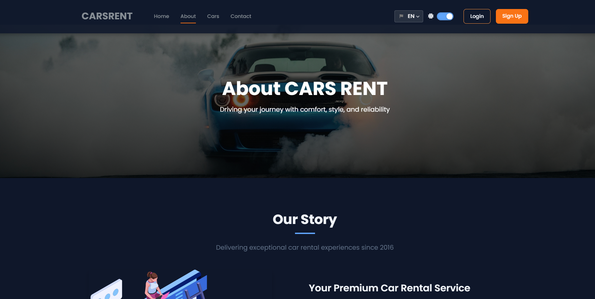
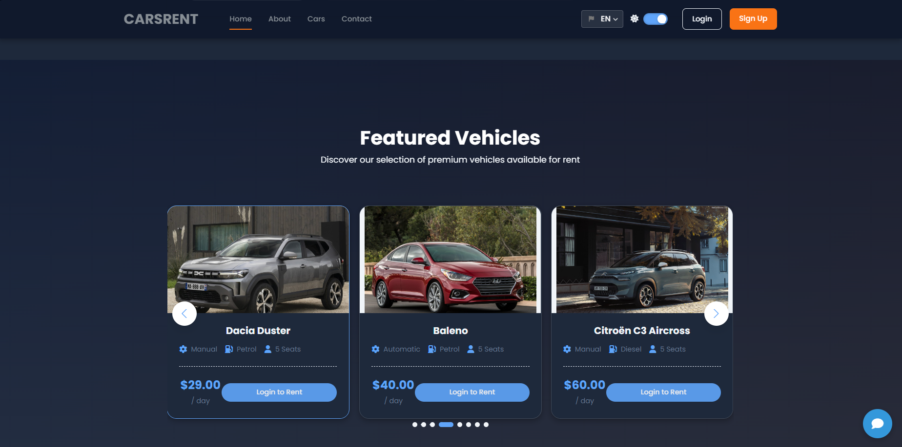
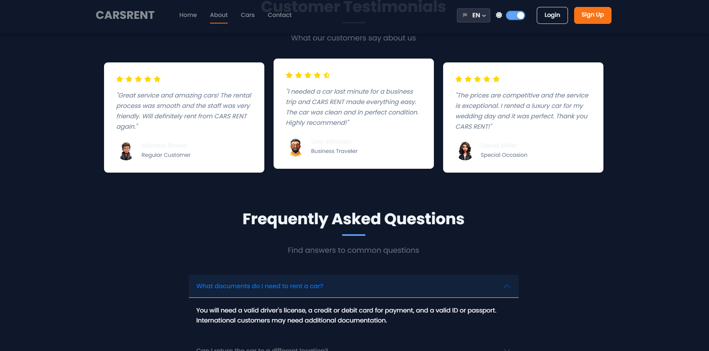
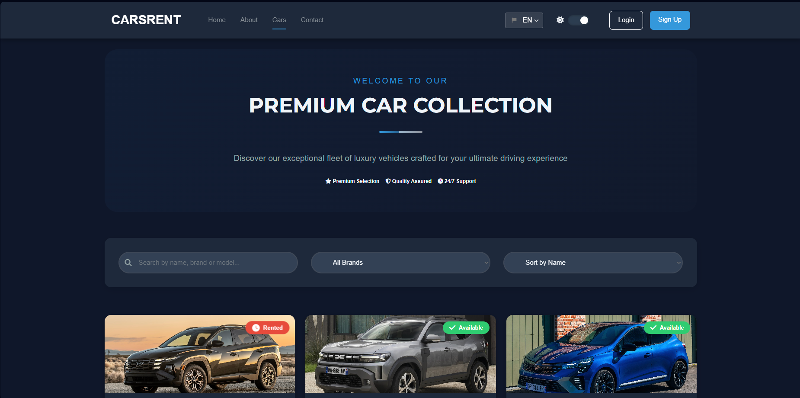
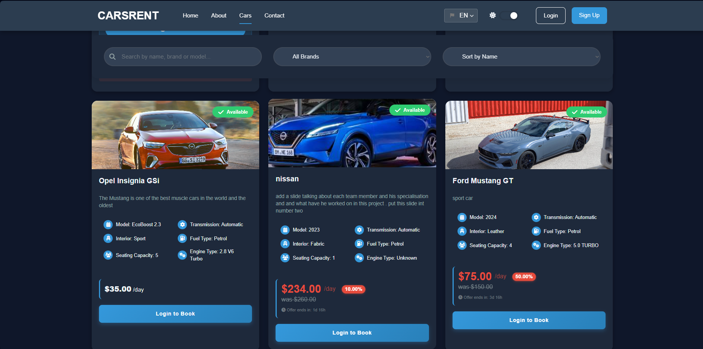
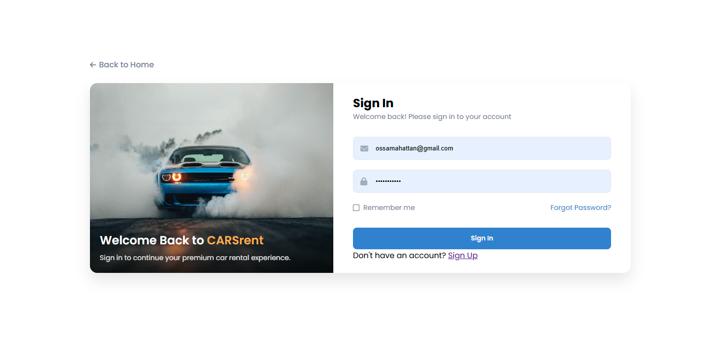

# CARS RENT - Car Rental Website

[](https://youtu.be/wZDCF0FLP7U)


## 📝 Overview

CARS RENT is a modern, feature-rich car rental web application that provides users with a seamless experience to browse, book, and rent vehicles. The platform offers an intuitive interface with multilingual support, dark mode, responsive design, and a secure payment system.

## ✨ Features

- **User Authentication & Management**
  - Account creation and management
  - Profile customization
  - Booking history and receipts

- **Advanced Car Browsing**
  - Detailed car specifications
  - High-quality image galleries
  - Filtering by type, price, and availability
  - Advanced search functionality

- **Booking System**
  - Real-time availability checking
  - Date range selection
  - Pricing calculation with discounts
  - Coupon code support

- **Enhanced User Experience**
  - Multi-language support (English, French, Arabic)
  - Dark/Light theme toggle
  - Responsive design for all devices
  - Interactive chatbot assistance

- **Admin Dashboard**
  - Car fleet management
  - User management
  - Booking oversight
  - Discount and coupon management
  - Sales reporting and analytics

- **Secure Payment Processing**
  - Multiple payment method support
  - Secure transaction handling
  - Invoice generation

## 🛠️ Technologies Used

- **Frontend**
  - HTML5, CSS3, JavaScript
  - Bootstrap 5
  - FontAwesome
  - Swiper.js
  - AOS Animation Library

- **Backend**
  - PHP
  - MySQL Database
  - FPDF (for PDF generation)

- **Additional Tools**
  - SASS/SCSS for styling
  - AJAX for asynchronous requests

## 📋 Requirements

- PHP 7.4 or higher
- MySQL 5.7 or higher
- Web server (Apache recommended)
- XAMPP, WAMP, MAMP, or similar local development environment

## 🚀 Installation

1. **Clone the repository**

   ```bash
   git clone https://github.com/ossama21/Cars_Rental_WebSite-Project.git
   ```

2. **Set up your local environment**
   - Install XAMPP, WAMP, or similar environment
   - Start Apache and MySQL services

3. **Configure the database**
   - Create a database named `car_rent`
   - Import the SQL files from `Car-Rent-Website/admin/car_rent.sql`
   - Run additional SQL scripts in the `database` directory if needed

4. **Configure the application**
   - Update database connection settings in `Car-Rent-Website/data/connect.php`
   - Ensure file permissions are set correctly

5. **Access the application**
   - Navigate to `http://localhost/Cars_Rental_V2.0/Car-Rent-Website/`
   - Admin access: Use the admin credentials to log in to the admin dashboard

## 📂 Project Structure

- **Car-Rent-Website/**: Main application directory
  - **admin/**: Admin dashboard and management tools
  - **css/**: Stylesheets for the application
  - **data/**: Data handling scripts and APIs
  - **images/**: Image assets for cars and UI
  - **includes/**: Reusable PHP components
  - **js/**: JavaScript files for client-side functionality
  - **languages/**: Language files for multilingual support
  - **loading/**: Loading animations and screens

- **database/**: Database scripts and initialization
- **font/**: Font files for PDF generation
- **assets/**: Additional assets for the project

## 🌐 Browser Support

- Chrome (latest)
- Firefox (latest)
- Safari (latest)
- Edge (latest)
- Opera (latest)

## 🤝 Contributing

Contributions are welcome! Please feel free to submit a Pull Request.

1. Fork the repository
2. Create your feature branch (`git checkout -b feature/amazing-feature`)
3. Commit your changes (`git commit -m 'Add some amazing feature'`)
4. Push to the branch (`git push origin feature/amazing-feature`)
5. Open a Pull Request

## 📜 License

This project is licensed under the MIT License - see the LICENSE file for details.

## 📞 Contact

- **Developer**: Ossama Hattan
- **Email**: <ossamahattan@gmail.com>
- **Facebook**: [Ossama Ossama](https://www.facebook.com/ossama.colombo/)

## 📸 Screenshots








<!-- Add more screenshots as needed -->

---

© 2025 CARS RENT. All rights reserved.
